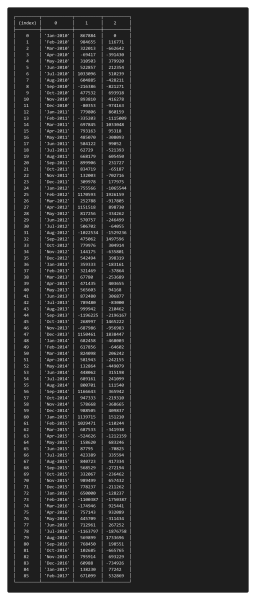
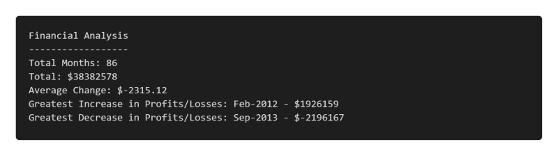

# 04-Console-Finances
JavaScript code for analyzing the financial records of a company.  

## Description
	
JavaScript code has been used to analyse a multi-dimensional array and return a **Financial Analysis Report**.  
Monthly Profit/Loss variations were calculated and added to the array. 

The code was required to compute the following:

- The total number of months in the report period. 
- The net total amount of Profit/Losses over the entire period.  
- The average of the changes in Profit/Losses over the entire period. 
- The greatest increase in Profit/Losses (date and amount) over the entire period.  
- The greatest decrease in Profit/Losses (date and amount) over the entire period.  
 
 

	
## Installation
	
n/a
	
## Usage
	   
To view code console, open **Developer Tools** in the browser.
	
## Credits
	
MDN Web Docs - Math - https://developer.mozilla.org/en-US/docs/Web/JavaScript/Reference/Global_Objects/Math  
JavaScript Multidimensional Array -  https://www.javascripttutorial.net/javascript-multidimensional-array/   
Get column from a two dimensional array - https://stackoverflow.com/questions/7848004/get-column-from-a-two-dimensional-array

## License
	
**MIT** - Please refer to the LICENSE in the repository.
